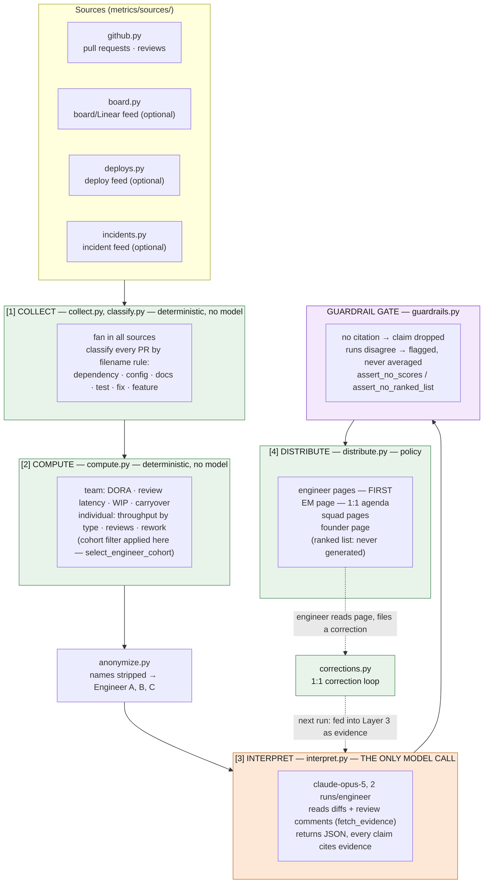
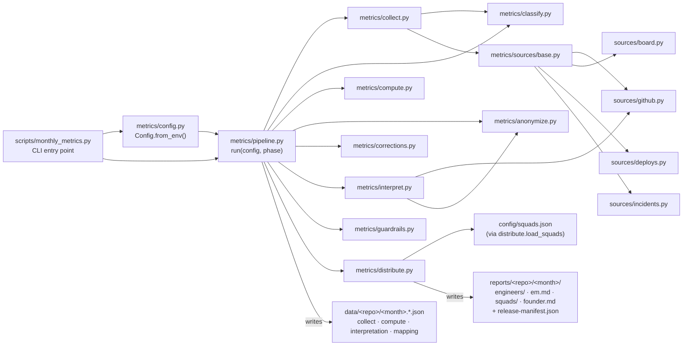
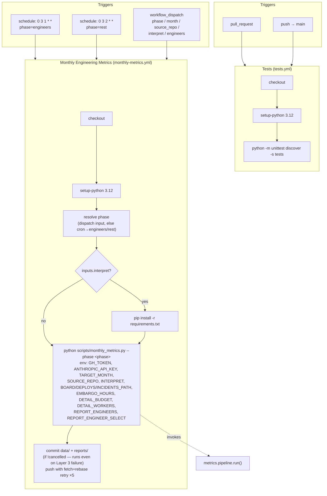

# Code Architecture

This document maps the codebase to the four-layer pipeline described in the
[README](README.md), including how the GitHub Actions workflows drive it.
Diagrams are Mermaid and render natively on GitHub. A print-friendly PDF of
the same three diagrams is at [`docs/architecture-diagrams.pdf`](docs/architecture-diagrams.pdf).

---

## 1. System overview



**Layers 1, 2 and the gate are code. Layer 3 is the model. Layer 4 is policy.**

---

## 2. Module map



| Module | Layer | Responsibility |
|---|---|---|
| `metrics/sources/base.py`, `github.py`, `board.py`, `deploys.py`, `incidents.py` | Sources | One adapter per source box; missing feeds report "insufficient evidence", never a silent zero |
| `metrics/classify.py` | 1 | Filename-rule PR classification (dependency/config/docs/test/fix/feature) |
| `metrics/collect.py` | 1 | Fans sources in, threads the per-PR detail fetch (`DETAIL_WORKERS`) |
| `metrics/compute.py` | 2 | Deterministic DORA/flow/individual metrics; `select_engineer_cohort` for `REPORT_ENGINEERS` |
| `metrics/anonymize.py` | 2→3 | Strips names to `Engineer A, B, C`; builds/uses the reversible mapping |
| `metrics/corrections.py` | loop | Reads `corrections/<repo>/<month>/<login>.json` back into Layer 3 |
| `metrics/interpret.py` | 3 | The only model call — schema-constrained JSON, 2 runs/engineer |
| `metrics/guardrails.py` | gate | Drops uncited claims, flags disagreement, asserts no scores/ranking |
| `metrics/distribute.py` | 4 | Per-audience page rendering + embargo (`EmbargoError`) |
| `metrics/config.py` | — | `Config` dataclass, environment-variable parsing (`env`, `env_int`, `env_bool`, `env_list`) |
| `metrics/pipeline.py` | — | Orchestrator: `run(config, phase)`, `fetch_evidence`, disk-only `rest` phase |
| `scripts/monthly_metrics.py` | — | CLI entry point; maps exit codes (`0` ok, `3` embargo, `4` missing data, `5` Layer 3 failed) |
| `scripts/migrate_v1_artifacts.py` | — | One-off: strips legacy `rank` fields from historical `data/` |

---

## 3. GitHub Actions

Two workflows in `.github/workflows/`, split deliberately: the scheduled
metrics run never executes tests (it's a demo/production job producing
reports), and `tests.yml` exists specifically to cover the deterministic
layers and the gate before a PR merges.



### Workflow reference

| Workflow | File | Triggers | Permissions | Concurrency |
|---|---|---|---|---|
| Tests | `.github/workflows/tests.yml` | `pull_request`, `push` to `main` | `contents: read` | cancels in-progress per ref |
| Monthly Engineering Metrics | `.github/workflows/monthly-metrics.yml` | `schedule` (1st & 2nd of month, 03:00 UTC), `workflow_dispatch` | `contents: write` (commits reports) | queued, never cancelled (`monthly-metrics` group) |

### `monthly-metrics.yml` phase resolution

| Firing | Resolved phase | Effect |
|---|---|---|
| Cron `0 3 1 * *` | `engineers` | Layers 1–3 + gate + engineer pages; stamps `release-manifest.json` |
| Cron `0 3 2 * *` | `rest` | Reads `data/` from disk, writes EM/squad/founder pages — **fails if the 24h embargo hasn't elapsed** |
| `workflow_dispatch` with `phase` input | that input | Manual override of the above, plus `collect`/`all` |

This cron split *is* the "engineer FIRST" guarantee from the README, enforced
by `metrics/distribute.py`'s `EmbargoError` (exit code `3`) rather than by
convention — running `rest` early fails the job.

### Secrets, variables and how they map to `Config`

The workflow's `env:` block is the only place outside `metrics/config.py`
that names these variables; `Config.from_env()` (`metrics/config.py:72`) is
what actually consumes them at runtime.

| Workflow source | Env var | `Config` field |
|---|---|---|
| `secrets.GITHUB_TOKEN` | `GH_TOKEN` | `token` |
| `secrets.ANTHROPIC_API_KEY` | `ANTHROPIC_API_KEY` | read directly by `metrics/interpret.py` |
| `inputs.month` | `TARGET_MONTH` | `month` (CLI `--month`) |
| `inputs.source_repo` | `SOURCE_REPO` | `repo` (CLI `--repo`) |
| `inputs.interpret` | `INTERPRET` | `interpret` |
| `vars.BOARD_PATH` / `DEPLOYS_PATH` / `INCIDENTS_PATH` | same | `board_path` / `deploys_path` / `incidents_path` |
| `vars.EMBARGO_HOURS` (default `24`) | `EMBARGO_HOURS` | `embargo_hours` |
| `vars.DETAIL_BUDGET` | `DETAIL_BUDGET` | `detail_budget` |
| `vars.DETAIL_WORKERS` (default `8`) | `DETAIL_WORKERS` | `detail_workers` |
| `inputs.engineers` or `vars.REPORT_ENGINEERS` | `REPORT_ENGINEERS` | `report_engineers` |
| `vars.REPORT_ENGINEER_SELECT` (default `activity`) | `REPORT_ENGINEER_SELECT` | `report_engineer_select` |

### Exit codes surfaced by the workflow

`scripts/monthly_metrics.py` turns pipeline outcomes into process exit codes,
which is what makes the "commit and push" step's `if: ${{ !cancelled() }}`
meaningful — it runs even when the pipeline step goes red:

| Exit | Meaning | Commit-and-push step still runs? |
|---|---|---|
| `0` | Full success | yes |
| `3` | Embargo not yet elapsed (`rest` too early) | yes (nothing new to commit) |
| `4` | `rest` run with no `engineers` data on disk | yes |
| `5` | Deterministic layers wrote a report, but Layer 3 failed | yes — deterministic report is committed, job still shows red |

---

## 4. Directory layout

```
metrics/            pipeline package (see module map above)
scripts/            CLI entry points
config/             squads.json + feed format docs
data/<repo>/         layer 1/2/3 JSON artifacts, one file per stage per month
reports/<repo>/<month>/   rendered audience pages (engineers/, em.md, squads/, founder.md)
tests/               unit tests for the deterministic layers + the gate
.github/workflows/   tests.yml, monthly-metrics.yml
```
